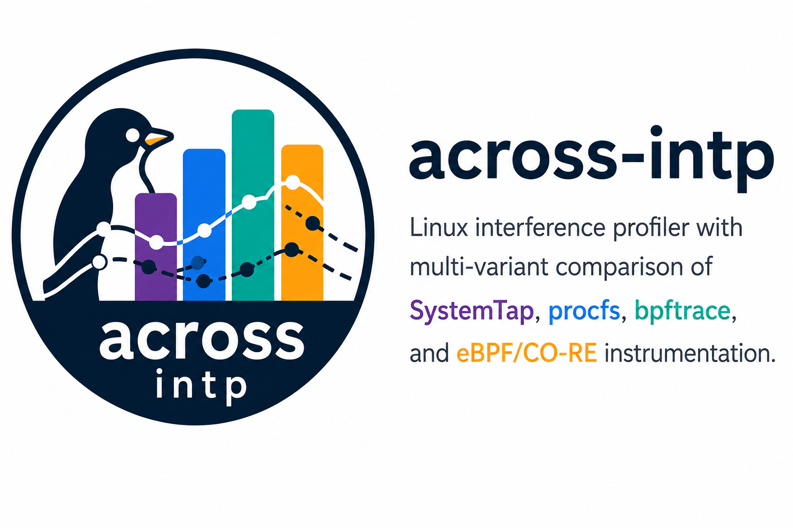

# Across-IntP: Multi-Variant Interference Profiler



This repository contains nine implementation variants of IntP, an interference
profiler that collects 7 metrics from the Linux kernel. The variants are
organized for systematic comparison as part of a Master's dissertation on
kernel instrumentation for interference profiling (PPGCC/PUCRS, advisor
Prof. Cesar De Rose). It is the companion artifact of the SBAC-PAD 2026 paper
that reports the comparison.

**Three of the nine are the measured versions** the paper evaluates:
**V0.2 (intp-baseline)**, the legacy-faithful reference, which keeps the 2022
SystemTap probe set verbatim and isolates the two RCU-unsafe operations in a
userspace helper; **V2 (C-ABI)**, a portable C implementation on stable
userspace ABIs; and **V3.2 (eBPF-CORE)**, eBPF/CO-RE with in-kernel
aggregation. The other six (stap-2022, stap-nollc, stap-nohelper, stap-modern,
ebpf-ring, bpftrace) are structural evidence: they document the portability and
reliability cliffs, prove out an architecture, or corroborate the measured
results. The comparison axes are **portability, overhead, and fidelity**.

## About

**Author:** André Sacilotto Santos (PPGCC/PUCRS)
**Advisor:** Prof. Cesar De Rose
**Program:** Post-Graduate Program in Computer Science -- PPGCC, PUCRS
**Research Area:** Cloud computing performance, kernel instrumentation, interference profiling

### Background

IntP (Interference Profiler) was originally developed by Xavier et al. (2022, PUCRS)
as a SystemTap-based tool for measuring resource interference between co-located workloads
in cloud environments. It collects seven low-level metrics (network physical, network
stack, block I/O, memory bandwidth, LLC miss ratio, LLC occupancy, CPU) to characterize
how one tenant's resource usage affects another's performance.

This work extends and refactors IntP to support modern Linux kernels (6.8+) and
modern instrumentation frameworks (bpftrace, eBPF/CO-RE), addressing the fragility of
the original SystemTap approach across kernel versions and hardware architectures.

### Research Goals

1. Reproduce the original IntP baseline (stap-2022) and document breakage on kernel 6.8+.
2. Develop minimal patches to restore functionality on current kernels (stap-nollc, stap-nohelper) and stap+helper hybrids that recover full metric coverage without RCU-unsafe operations: legacy-intp-baseline on kernel 5.15 GA (Ubuntu 22.04, paper-faithful stap-2022 semantics) and stap-modern on kernel 6.8+.
3. Implement kernel-module-free alternatives using procfs/perf_event (C-ABI), bpftrace, and eBPF/CO-RE (ebpf-ring).
4. Compare all nine variants across the paper's three axes — portability, overhead, and fidelity — plus deployment complexity and safety.

### Status

Role names follow the paper's Table I. **Measured** marks the three versions the
paper's results are computed from; the rest are structural evidence.

| Variant | Role (paper Table I) | Status |
| --------- | -------- | -------- |
| V0 (stap-2022) -- Original (SystemTap, needs `intel_cqm` driver — mainline removed it in 4.14) | Cliff (portability) | Reference only; in practice runs only on a pre-4.14 mainline kernel, an enterprise kernel still carrying the `intel_cqm` backport, or a custom build with the driver restored |
| V0.1 (stap-nollc) -- Updated (SystemTap, LLC disabled) | Cliff (portability, partial) | Complete; recovers compilation at the cost of `llcocc` (6/7 metrics) |
| V0.2 (legacy-intp-baseline) -- Stap + userspace helper (SystemTap, 5.15 GA, stap-2022-faithful, RCU-safe) | **Measured** (`intp-baseline`) | Complete; the campaign's UB22 leg (kernel 5.15.0-177) |
| V1 (stap-nohelper) -- Stap-native (SystemTap, 6.8+, mbw/llcocc disabled) | Cliff (reliability) | Complete; emits `mbw`/`llcocc` as zeros and destabilizes `systemd-logind` — that is the result it exists to show |
| V1.1 (stap-modern) -- Stap + userspace helper (SystemTap, 6.8+, full metrics, RCU-safe) | Arch. proof (kernel 6.8) | Complete; carries the V0.2 helper design to 6.8 to prove SystemTap needs it there. Not a measured endpoint. HiBench distributed-mode limitation documented in METRICS-ALIGNMENT.md |
| V2 (C-ABI) -- C / procfs / perf_event / resctrl | **Measured** | Complete; the campaign's UB24 leg (kernel 6.8.0-111) |
| V3.1 (bpftrace) -- bpftrace + Python orchestrator | Companion (corroboration) | Complete; mirrors V3's attachment points |
| V3 (ebpf-ring) -- eBPF/CO-RE (libbpf, ring-buffer-streaming) | Predecessor (mechanism) | Complete; retained to contrast overhead profiles with V3.2 — it is the variant that shows the ~194-416x context-switch amplification |
| V3.2 (eBPF-CORE) -- eBPF/CO-RE (libbpf, in-kernel-aggregating, paper §III-A) | **Measured** | Complete; the campaign's UB24 leg (kernel 6.8.0-111) |

All measurements were collected on a single-socket Intel Xeon Gold 5412U
(Sapphire Rapids, 24 physical / 48 logical cores, 256 GB DDR5), dual-booted
across the two kernel series.

### Citation

This repository is the companion artifact of a paper accepted at
**SBAC-PAD 2026**; release `v0.1.0` carries the measurement data behind its
figures and tables. If you use this software in your research, please cite it
using the metadata in [CITATION.cff](CITATION.cff). A full thesis citation
will be added upon defense (expected until March 2027).

Arriving from the paper? [docs/READER-MAP.md](docs/READER-MAP.md) maps every
figure, table and claim to its path here or in the release artifact.

### Where the measurement data lives

**The campaign data and the rendered figures are not files in this repository.**
They ship as **release assets** attached to
[`v0.1.0`](https://github.com/ggrv-intp/across-intp/releases/tag/v0.1.0) — about
350 MB of measurement output that would swamp a source tree. Download them from
the release page; cloning the repository will not produce them.

| Release asset | What it holds |
| --- | --- |
| `across-intp-sbac-results-v0.1.0.tar.gz` | The anonymized campaign payload: the fusion tree of `run.json` records and profiler traces, `aggregate-means.tsv`, the fragility tables, the §V backing tables under `paper-tables/`, and `published/` with the 33 figure PDFs — 13 of them camera-ready renders — plus `QA-FIGS.md`, the typography gate report |
| `consolidation-raw.tar.gz` | The pre-anonymization raw sources: the five measurement sessions across two hosts, the auxiliary reruns behind the §V-B amplification result, and the fusion trees with their PROVENANCE records |
| `SHA256SUMS` | Integrity reference covering both tarballs |

What this repository *does* carry is everything that **produced** those assets:
the nine variants under `variants/`, the campaign drivers and complete plotting
pipeline under `bench/`, and
[sbac-results/PROVENANCE.md](sbac-results/PROVENANCE.md) — the chain from the
measurement sessions to the published tarballs. Note that `sbac-results/` holds
that provenance record and its README **only**; the results themselves are in
the release assets, not in that directory.

In [docs/READER-MAP.md](docs/READER-MAP.md) every row is tagged **repo:** or
**artifact:** precisely so this stays unambiguous.

## Variant Comparison

| Feature                  | V0 classic | V0.1 k68 | V0.2 helper | V1 native | V1.1 helper | V2 stable-abi | V3.1 bpftrace | V3 ebpf-core | V3.2 eBPF-CORE |
|--------------------------|:----------:|:--------:|:-----------:|:---------:|:-----------:|:-------------:|:-------------:|:------------:|:-------------:|
| Kernel module required   |    Yes     |   Yes    |     Yes     |    Yes    |     Yes     |      No       |     No        |      No      |      No       |
| Userspace helper         |    No      |   No     |     Yes     |    No     |     Yes     |      n/a      |     Yes       |     Yes      |      Yes      |
| Debuginfo required       |    Yes     |   Yes    |     Yes     |    Yes    |     Yes     |      No       |   No (BTF)    |   No (BTF)   |   No (BTF)    |
| Kernel crash risk        |    High    |   High   |     Low     |    Low    |     Low     |     None      |    None       |     None     |     None      |
| Min kernel version       |   <=6.6    |   6.8+   |  5.15 GA    |    6.8+   |     6.8+    |     4.10+     |    5.8+       |     5.8+     |     5.8+      |
| netp                     |     x      |    x     |      x      |     x     |      x      |       x       |       x       |       x      |       x       |
| nets (service-time)      |     x      |    x     |      x      |     x     |      x      |       ~       |       x       |       x      |       x       |
| blk                      |     x      |    x     |      x      |     x     |      x      |       x       |       x       |       x      |       x       |
| mbw                      |     x      |    x     |      x      |     -     |      x      |       x       |       x       |       x      | x + raw MB/s  |
| llcmr                    |     x      |    x     |      x      |     x     |      x      |       x       |       x       |       x      |       x       |
| llcocc                   |     x      |    -     |      x      |     -     |      x      |       x       |       x       |       x      |       x       |
| cpu                      |     x      |    x     |      x      |     x     |      x      |       x       |       x       |       x      |       x       |
| Framework                | SystemTap  | SystemTap| SystemTap+C | SystemTap | SystemTap+C |     None      |   bpftrace    |    libbpf    |    libbpf     |
| Per-event introspection  |    Yes     |   Yes    |     Yes     |    Yes    |     Yes     |      No       |     Yes       |     Yes      |      No       |
| AMD EPYC compatible      |  Partial   |  Partial |   Partial   |  Partial  |   Partial   |      Yes      |     Yes       |      Yes     |      Yes      |
| ARM server compatible    |    No      |   No     |     No      |    No     |     No      |    Partial    |   Partial     |    Partial   |    Partial    |

x = supported, ~ = polling approximation, - = disabled in this build

## The 7 Metrics

- **netp** -- Network physical utilization (NIC TX+RX bandwidth)
- **nets** -- Network stack utilization (kernel networking service time)
- **blk** -- Block I/O utilization (disk busy percentage)
- **mbw** -- Memory bandwidth utilization (LLC-to-DRAM traffic)
- **llcmr** -- LLC miss ratio (cache misses / cache references)
- **llcocc** -- LLC occupancy (bytes of last-level cache occupied)
- **cpu** -- CPU utilization (user + system time percentage)

## Directory Layout

```text
.
|-- README.md                  This file
|-- LICENSE                    MIT license
|-- CITATION.cff               Citation metadata (software + the SBAC-PAD 2026 paper)
|-- VERSIONS.md                Variant-naming map (current vs legacy pre-2026-05-05)
|-- DECISIONS.md               Decision log, including the two release refreshes (D10, D11)
|-- METRICS-ALIGNMENT.md       Per-metric equivalence across variants, and where it is only approximate
|-- Makefile                   Build entry points for the compiled variants
|-- capabilities-sbacpad.env   Capability snapshot of the campaign host
|-- run-big-batch.sh           Full campaign driver (stress-ng + HiBench, all envs)
|-- run-smoke-all.sh           Fast all-variant sanity sweep
|-- ub22run.sh / ub24run.sh    Per-OS campaign drivers (kernel 5.15 leg / kernel 6.8 leg)
|-- docs/                      Cross-variant documentation
|   |-- READER-MAP.md          Start here if you arrived from the paper
|   |-- METRICS-DEEP-DIVE.md   Probe points, formulas and constants behind the 7 metrics
|   |-- VARIANT-COMPARISON.md  Detailed rationale for each of the nine variants
|   |-- KERNEL-6.8-CHANGES.md  What kernel 6.8 broke and why
|   |-- PORTABILITY-ROADMAP.md Cross-kernel, cross-arch analysis
|   |-- HARDWARE-COMPATIBILITY.md  RDT / PQoS / MPAM feature tables
|   |-- EXPERIMENT-STRATEGY.md Operational gotchas, run discipline, workload->metric stress map
|   |-- V3-OVERHEAD-FINDINGS.md  Context-switch amplification, its decomposition, the mbw silent clip
|   |-- CROSS-ENV-CAMPAIGN.md  bare / container / VM campaign design
|   |-- NETP-SYNTHETIC-TRAFFIC.md  veth + iperf3 workload rationale
|   |-- PAPER-CROSS-REFERENCES.md  Historical (writing phase); draft section numbering
|   |-- images/                Repository banner
|-- shared/                    Components used across variants
|   |-- intp-detect.sh         Hardware capability detection
|   |-- intp-preflight.sh      Pre-run environment gate
|   |-- intp-resctrl-helper.sh resctrl companion daemon
|   |-- intp-ebpf-checkout.sh  libbpf/vmlinux.h bootstrap for the eBPF variants
|   |-- validate-cross-variant.sh  Cross-variant output contract check
|-- variants/                  One directory per IntP implementation variant
|   |-- v0-stap-2022/          Unmodified 2022 IntP (SystemTap; needs pre-4.14 cqm_rmid)
|   |-- v0.1-stap-nollc/       Compilation recovered by dropping llcocc (6/7 metrics)
|   |-- v0.2-legacy-intp-baseline/  MEASURED `intp-baseline`: kernel 5.15, V0-faithful stap + userspace helper
|   |-- v1-stap-nohelper/      Kernel 6.8+, stap-native probes (mbw/llcocc disabled)
|   |-- v1.1-stap-modern/      Kernel 6.8+, stap + userspace helper (architectural proof)
|   |-- v2-c-abi/              MEASURED `C-ABI`: pure C over procfs / perf_event_open / resctrl
|   |-- v3-ebpf-ring/          eBPF/CO-RE with libbpf, ring-buffer-streaming
|   |-- v3.1-bpftrace/         bpftrace scripts + Python orchestrator + resctrl
|   |-- v3.2-ebpf-core/        MEASURED `eBPF-CORE`: eBPF/CO-RE, in-kernel aggregation (paper §III-A)
|-- bench/                     Campaign harness and analysis pipeline
|   |-- OVERVIEW.md            Workload table, campaign stages, run accounting
|   |-- run-intp-bench.sh      stress-ng campaign driver (per-variant kernel gates live here)
|   |-- run-os-campaign.sh     Per-OS leg orchestration
|   |-- publish-sbac-results.sh  Merge a campaign tree into sbac-results/ layout
|   |-- plot/                  Full plotting pipeline + camera-ready figure gate
|   |-- hibench/               HiBench Spark subset provisioning and sweep
|   |-- setup/                 Testbed provisioning, REPRODUCTION.md
|   |-- findings/              Per-campaign empirical notes
|   |-- deploy/                Remote deployment helpers
|   |-- iada/                  IADA downstream-classifier integration
|-- sbac-results/              Provenance record ONLY -- the data itself is a release asset
|   |-- PROVENANCE.md          Chain from the measurement sessions to the published tarballs
|   |-- README.md              Layout of the published tree inside the artifact
```

The campaign output tree (`results/`) is gitignored: it is reproduced by the
drivers above, and its published form ships as the release assets described in
[Where the measurement data lives](#where-the-measurement-data-lives).

## Quick Start

### V0 (stap-2022) -- Original IntP (kernel <= 6.6)

```bash
cd variants/v0-stap-2022
sudo stap -g intp.stp <PID> <interval_ms>
```

Requires: SystemTap, kernel debuginfo, kernel <= 6.6.

### V0.1 (stap-nollc) -- Updated for Kernel 6.8 (LLC disabled)

```bash
cd variants/v0.1-stap-nollc
sudo stap -g intp-6.8.stp <PID> <interval_ms>
```

Requires: SystemTap, kernel debuginfo, kernel 6.8+. Note: llcocc returns 0.

### V0.2 (legacy-intp-baseline) -- stap-2022-faithful + userspace helper (kernel 5.15 GA / Ubuntu 22.04)

```bash
cd variants/v0.2-legacy-intp-baseline
make
sudo INTP_HELPER_IMC_PMU_TYPE=14 \
     INTP_HELPER_DRAM_BW_MBPS=34000 \
     INTP_HELPER_L3_SIZE_KB=35840 \
     ./intp-helper <comm-pattern> &
sudo bash generate-stp.sh
sudo stap -g intp.recal.stp <comm-pattern>
# after run: kill the helper
```

Requires: SystemTap, kernel debuginfo, **kernel 5.15 GA (Ubuntu 22.04)**,
Intel RDT (resctrl) for `llcocc`, uncore IMC PMU for `mbw`. Same helper
pattern as stap-modern, but the SystemTap script keeps the paper-faithful stap-2022
probes (no softirq tapset switch). The helper isolates the two RCU-unsafe
operations (uncore IMC perf events, cqm_rmid LLC occupancy) from probe
context, eliminating stap-2022's fragility cliff on the Canonical RCU-backport
kernel.

### V1 (stap-nohelper) -- Stap-native (5/7 metrics; no helper, no embedded I/O)

```bash
cd variants/v1-stap-nohelper
sudo stap -g intp-resctrl.stp <comm-pattern>
```

Requires: SystemTap 5.x, kernel debuginfo, kernel 6.8+. mbw and llcocc are
reported as 0 (deferred to stap-modern).

### V1.1 (stap-modern) -- Stap + userspace helper (full 7/7 metrics, RCU-safe)

```bash
cd variants/v1.1-stap-modern
make
sudo ./intp-helper <comm-pattern> &
sudo stap -g intp-v1.1.stp <comm-pattern>
# after run: kill the helper
```

Requires: SystemTap 5.x, kernel debuginfo, kernel 6.8+, Intel RDT (resctrl)
for `llcocc`, uncore IMC PMU for `mbw`. mbw/llcocc gracefully degrade to 0
if hardware is unavailable.

### V2 (C-ABI) -- C: procfs / perf_event / resctrl

```bash
cd variants/v2-c-abi
make
sudo ./intp-c-abi -p <PID> -i <interval_ms>
```

No framework dependencies. Requires: resctrl for mbw/llcocc.

### V3.1 (bpftrace) -- bpftrace

```bash
cd variants/v3.1-bpftrace
sudo ./run-intp-bpftrace.sh <PID> <interval_ms>
```

Requires: bpftrace, kernel BTF, resctrl for mbw/llcocc.

### V3 (ebpf-ring) -- eBPF/CO-RE

```bash
cd variants/v3-ebpf-ring
make
sudo ./intp-ebpf-ring -p <PID> -i <interval_ms>
```

Requires: libbpf, clang, kernel BTF, resctrl for mbw/llcocc.

### V3.2 (eBPF-CORE) -- eBPF/CO-RE in-kernel aggregating

```bash
cd variants/v3.2-ebpf-core
make
sudo ./intp-ebpf-core --pids <PID> --interval <seconds>

# Critical acceptance gate before campaign inclusion:
sudo make test-amplification
```

eBPF-CORE is the in-kernel-aggregating variant specified in paper §III-A:
same probe set as ebpf-ring, but the 16 MiB ring buffer is replaced
with per-CPU + per-PID counter maps polled once per `--interval`.
The userspace consumer is no longer draining a continuous event
stream, which eliminates the 194-416x context-switch amplification
documented in paper §V-B -- the auxiliary rerun measures eBPF-CORE at
1.0x the no-profiler baseline on all three reference loads.

Requires: libbpf, clang, kernel BTF, resctrl for mbw/llcocc (same as
ebpf-ring). Adds a trailing `mbw_raw_mbps` diagnostic column to the TSV
output (suppressible via `--no-raw-mbw`); the first 7 columns stay
byte-compatible with ebpf-ring.

### Full per-OS campaign (one command)

`ub24run.sh` and `ub22run.sh` (repo root) run the entire SBAC-PAD
pipeline for one OS leg end to end: veth setup -> stress-ng (cluster
down) -> bring Hadoop/Spark/HiBench up -> HiBench (cluster up) -> tear
down -> publish into `sbac-results/`.

```bash
sudo bash ub24run.sh             # Ubuntu 24.04 leg -- v1.1, v2, v3.2
sudo bash ub22run.sh             # Ubuntu 22.04 leg -- v0.2
sudo bash ub24run.sh --dry-run   # preview every step, run nothing
```

Both wrap `bench/run-os-campaign.sh` (`--help` for all knobs and the
`SKIP_*` resume flags). See
[bench/setup/REPRODUCTION.md](bench/setup/REPRODUCTION.md) section 9b.

## Documentation

- [Hardware Compatibility](docs/HARDWARE-COMPATIBILITY.md) -- RDT, PQoS, MPAM tables
- [Kernel 6.8 Changes](docs/KERNEL-6.8-CHANGES.md) -- What broke and the fix paths
- [Metrics Deep Dive](docs/METRICS-DEEP-DIVE.md) -- Kernel probe points, formulas, constants
- [Portability Roadmap](docs/PORTABILITY-ROADMAP.md) -- Cross-kernel, cross-arch analysis
- [Variant Comparison](docs/VARIANT-COMPARISON.md) -- Detailed rationale for each variant
- [Experiment Strategy](docs/EXPERIMENT-STRATEGY.md) -- Operational gotchas, run discipline, workload→metric stress map
- [Reader Map](docs/READER-MAP.md) -- **Start here if you arrived from the paper.** Every figure, table and claim mapped to its path in this repo or in the release artifact, including the Overleaf-to-artifact filename mapping
- [Paper Cross-References](docs/PAPER-CROSS-REFERENCES.md) -- *Historical (writing phase).* Maps each `[TODO: ...]` in the paper **draft** to the repo doc carrying the material; its section and figure numbers are the draft's, not the camera-ready's
- [Bench Findings Index](bench/findings/README.md) -- Centralized empirical findings (stap-2022 baseline diagnosis, stap-nohelper reliability notes)

## References

- **Original IntP source repository:** [projectintp/intp](https://github.com/projectintp/intp).
- **Original IntP paper:** Xavier, M. G., Cano, C. H. C., Meyer, V., and De Rose, C. A. F. (2022). *IntP: Quantifying Cross-Application Interference via System-Level Instrumentation*. SBAC-PAD 2022, Bordeaux, France, pp. 231-240. IEEE. PUCRS. PDF: <https://repositorio.pucrs.br/dspace/bitstream/10923/24018/2/IntP_Quantifying_crossapplication_interference_via_systemlevel_instrumentation.pdf>. IEEE: <https://ieeexplore.ieee.org/document/9980934/>.
- **IADA (interference-aware scheduler that consumes IntP):** Meyer, V., da Silva, M. L., Kirchoff, D. F., De Rose, C. A. F. (2022). *IADA: A dynamic interference-aware cloud scheduling architecture for latency-sensitive workloads*. Journal of Systems and Software, vol. 194, pp. 111491. PUCRS.
- **iprof -- eBPF interference profiler (related work, TU Berlin):**
  - Gögge, R. (2023). *Finding noisy neighbours: Measuring application interference with system-level instrumentation using eBPF*. Master's thesis, Technical University of Berlin. Supervised by Sören Becker and Prof. Dr. Odej Kao.
  - Becker, S., Goegge, R., Kao, O. (2024). *Measuring application interference with system-level instrumentation*. IEEE/ACM International Conference on Utility and Cloud Computing Companion (UCC Companion). Technical University of Berlin.
- **PRISM (related work, Utrecht):** Landau, D., Barbosa, J., Saurabh, N. (2025). *eBPF-based instrumentation for generalisable diagnosis of performance degradation*. arXiv:2505.13160. <https://arxiv.org/abs/2505.13160>. Code: <https://github.com/EC-labs/prism>.
- **eBPF vs SystemTap overhead methodology:** Volpert, S., Eichhammer, P., Held, F., Huffert, T., Wesner, H. P., Domaschka, S. (2025). *Towards eBPF overhead quantification: An exemplary comparison of eBPF and SystemTap*. ICPE '25 Companion. ACM.
- **CO-RE portability study:** Zhong, S., Liu, J., Arpaci-Dusseau, A. C., Arpaci-Dusseau, R. H. (2025). *Revealing the unstable foundations of eBPF-based kernel extensions*. EuroSys '25. ACM. (University of Wisconsin-Madison.)
- **Intel RDT measurement caveats:** Sohal, P., Tabish, R., Drepper, U., Mancuso, R. (2022). *A closer look at Intel resource director technology (RDT)*. RTNS '22. ACM.
- **CO-RE reference guide:** Nakryiko, A. *BPF CO-RE reference guide*. <https://nakryiko.com/posts/bpf-core-reference-guide/>.

## License

MIT -- see [LICENSE](LICENSE).
